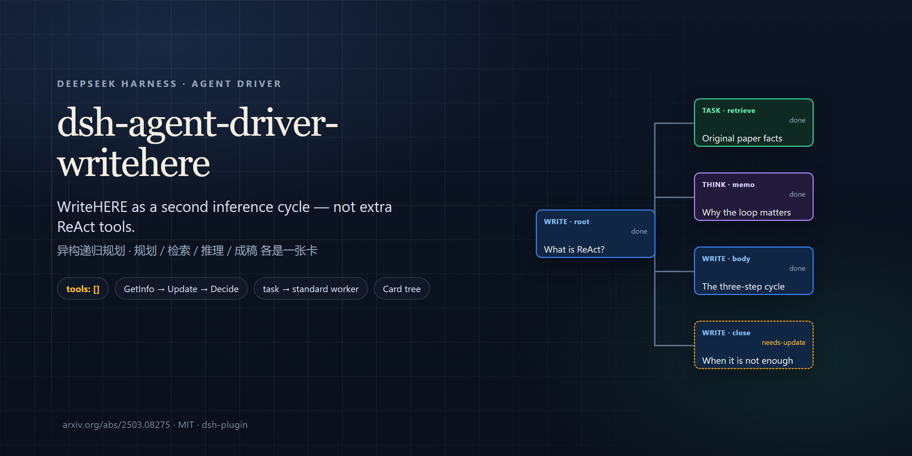
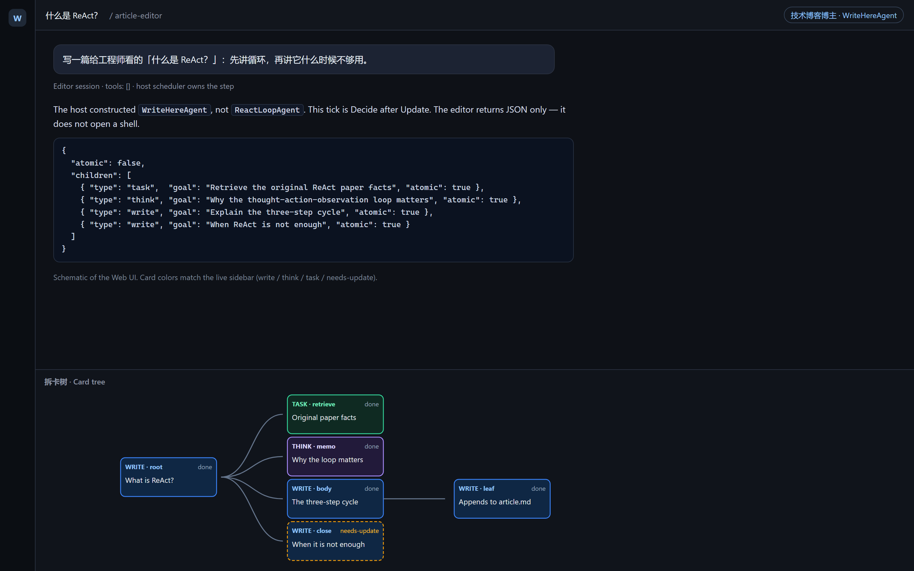
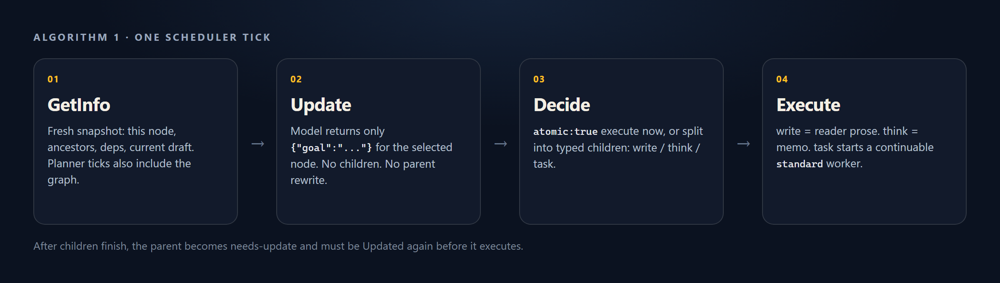

<p align="center">
  
</p>

<h1 align="center">dsh-agent-driver-writehere</h1>

<p align="center">
  English · <a href="README.zh.md">中文</a>
</p>

<p align="center">
  
  
  
  
  
  
  
  
</p>

<p align="center">
  <strong>A <a href="https://github.com/deepseek-ai/deepseek-harness">DeepSeek Harness</a> agent driver that runs the <a href="https://arxiv.org/abs/2503.08275">WriteHERE</a> long-form loop as a second inference cycle — not as extra ReAct tools.</strong><br>
  <em>GetInfo → Update → Decide → typed execute · tools: [] · task cards start a <code>standard</code> worker</em>
</p>

<p align="center">
  <a href="#what-it-is">What it is</a> ·
  <a href="#install">Install</a> ·
  <a href="#quick-start">Quick start</a> ·
  <a href="#how-a-tick-works">How a tick works</a> ·
  <a href="#customize">Customize</a> ·
  <a href="#extend">Extend</a> ·
  <a href="#what-it-is-not">What it is not</a> ·
  <a href="#requirements">Requirements</a> ·
  <a href="#credits">Credits</a>
</p>

## What it is

Long-form agents on a stock ReAct loop tend to flatten. The model outlines, then dumps; or it keeps calling tools until the transcript *is* the article. Mid-draft revision, “this paragraph still needs a fact,” and typed work (retrieve vs. reason vs. compose) have no first-class place to live.

[WriteHERE](https://arxiv.org/abs/2503.08275) treats writing as *heterogeneous recursive planning*: refine a node, then either execute it or split it into typed children. This package ports that loop onto DSH as a **host-owned scheduler**.

| | Stock ReAct session | This driver |
| --- | --- | --- |
| Constructor | `ReactLoopAgent` | `WriteHereAgent` |
| Editor tools | Native function calling | `tools: []` |
| Plan / retrieve / write | One growing transcript | Typed cards: `write` / `think` / `task` |
| Retrieval | Same session, more tool calls | Continuable `standard` worker |
| Draft | Whatever the model typed | Leaf `write` nodes append `article.md` |
| Web UI | Chat only | Optional **Card tree** sidebar |

<p align="center">
  
</p>

<p align="center"><sub>Schematic of the Web UI. Card colors match the live sidebar (write / think / task / needs-update). Not a live capture of a private session.</sub></p>

That is why this is an **agent driver** (`AgentLoop.prepare` can choose this constructor), not a bag of `article_*` tools on the default loop.

## Install

You need a working [DeepSeek Harness](https://github.com/deepseek-ai/deepseek-harness) (`dsh` on PATH, plus `pnpm`). The official loader is `dsh plugin add` — it runs `pnpm add` inside `$DSH_HOME/profiles/<name>` and, because this package declares `dsh.bundle`, appends a config layer.

### One line (recommended)

```sh
dsh plugin --profile web add github:Player-YN/dsh-agent-driver-writehere
dsh --profile web
```

That clones this repository into the `web` profile, registers the bundle, and installs `zod`. The first time the plugin loads, it copies **article-editor** into `~/.dsh/.agent-presets/` only if that folder does not already exist. Then: New session → preset **article-editor** (技术博客博主).

Pin a commit so `main` cannot move under you:

```sh
dsh plugin --profile web add github:Player-YN/dsh-agent-driver-writehere#<sha>
```

### Clone, then add

```sh
git clone https://github.com/Player-YN/dsh-agent-driver-writehere.git
cd dsh-agent-driver-writehere
dsh plugin --profile web add .
```

Windows, from a checkout (also copies the preset immediately):

```powershell
.\install.ps1
```

### Confirm, update, remove

```sh
dsh --profile web --dump-config   # look for "# == dsh-agent-driver-writehere"
dsh plugin --profile web update github:Player-YN/dsh-agent-driver-writehere
dsh plugin --profile web remove dsh-agent-driver-writehere
```

This package is not on the npm registry yet. If a profile already composes this driver from another layer, do not add the bundle a second time.

`install-remote.sh` / `install-remote.ps1` only wrap the official `add` and then copy the preset. They are optional. Only pipe a script you have read.

## Quick start

**Web** is the intended path.

1. Start the profile: `dsh --profile web` (or `dsh web`).
2. New session → preset **article-editor** (技术博客博主).
3. Send a topic, not a shell command.
4. Open the sidebar **Card tree**. Nodes grow as the scheduler splits and executes.
5. Leaf `write` nodes append to `article.md`. `task` nodes hand work to a `standard` worker and wait for the report.

The editor never opens a terminal. If you need a command, a repo read, or an external API, that is a `task` card’s job.

Headless, if the host forwards `--preset` onto `session.header.agentPreset`:

```sh
dsh --profile headless --preset article-editor "Why write-back is required"
```

A `task` card parks that process. Use Web when you need the worker to return.

## How a tick works

<p align="center">
  
</p>

1. The user topic becomes the root (a follow-up that is not a new topic continues the same tree).
2. The host constructs **WriteHereAgent**, not `ReactLoopAgent`.
3. **GetInfo** — selected node, ancestors, dependencies, current draft; planner ticks also include the structural graph.
4. **Update** — the model returns only `{"goal":"..."}` for *this* node.
5. **Decide** — `{"atomic":true}` to execute now, or `{"atomic":false,"children":[…]}` to split.
6. **Execute** — `write` is reader prose; `think` is a memo; `task` calls `startContinuable` with `preset: 'standard'`.

A later tick may find the node in `needs-update` after children finished. Update runs again before execute.

### What the model may return

| Tick | Allowed reply |
|------|----------------|
| Update | `{"goal":"..."}` — this node only; no children; do not rewrite a parent |
| Decide | `{"atomic":true}` or `{"atomic":false,"children":[{"type":"task"\|"think"\|"write","goal":"...","atomic":true}]}` |
| Write execute | Reader-facing paragraphs. Not JSON. Not a writer briefing. |
| Think execute | A reasoning memo, not manuscript |

Rules the scheduler enforces:

- A `write` parent that splits must include at least one `write` child.
- `think` and `task` stay atomic unless that child sets `atomic: false`.
- Optional `length` is a composition budget for `write` children only.
- Do not glue prose onto the decision JSON.

## Customize

Three layers, from cheapest to “you are forking the driver.”

| Layer | Where | Rebuild needed? |
| --- | --- | --- |
| Editor voice | `~/.dsh/.agent-presets/article-editor/agent.cordis.yml` (`persona` / `config.text`) | No. Restart `dsh web`. |
| Methodology | `~/.dsh/.agent-presets/article-editor/skills/<name>/SKILL.md` | No. Next planner tick re-reads the tree. |
| Tick instructions, worker persona, retrieval classifier | [`packages/writehere/src/prompts.ts`](packages/writehere/src/prompts.ts) | Yes: `node scripts/build.mjs`, then reinstall or restart against this checkout. |
| Bind another preset id to WriteHere | [`packages/writehere/src/index.ts`](packages/writehere/src/index.ts) `bindPreset(...)` | Yes. Only `article-editor` and `xieka` are bound today. |
| Algorithm / node types / `tools: []` | Scheduler + tree engine | Yes, and stay compatible with Algorithm 1. |

The first-load copy **does not overwrite** an existing `article-editor` roster directory. Edit the copy under `~/.dsh/.agent-presets/`. Delete that directory only if you want the shipped preset back.

### Which prompts you can change

| Prompt | File | Role |
| --- | --- | --- |
| Editor persona (what the model believes it is) | Preset `agent.cordis.yml` | Live system-facing voice. This is the usual customization. |
| Update tick | `UPDATE_INSTRUCTION` | Must stay “JSON `{"goal":"..."}` for this node only.” |
| Decide tick (write parent) | `DECIDE_WRITE_INSTRUCTION` | Must stay JSON `atomic` / `children`. |
| Decide tick (think / task) | `DECIDE_ATOM_INSTRUCTION` | Same JSON contract; defaults atomic. |
| Write / think execute | `EXECUTE_WRITE_INSTRUCTION`, `EXECUTE_THINK_INSTRUCTION` | Prose only. |
| Parent compose | `COMPOSE_WRITE_INSTRUCTION` | Prose only, after children finish. |
| Retrieval worker | `RETRIEVAL_PERSONA`, `RETRIEVAL_PROMPT_PREFIX` | Passed into `startContinuable` when `isRetrievalGoal(goal)` is true. |
| Other task worker | `LAB_PERSONA` | Same dispatch, non-retrieval tasks. |
| GetInfo wrappers | `GET_INFO_OPEN` / `GET_INFO_CLOSE` | Tags around the snapshot. Changing them without changing `completeText` will leak old snapshots. |

GetInfo **JSON shape** (node, ancestors, deps, draft, planner graph) is produced by [`packages/article-tree/src/getinfo.ts`](packages/article-tree/src/getinfo.ts). Treat that as protocol, not copy.

`DSH_JSON_SCHEMA=1` switches Update/Decide from `{ type: "json_object" }` to `{ type: "json_schema" }`. Leave it unset unless your adapter documents support — DeepSeek chat-completions still 400s `json_schema`.

## Extend

This loop is meant to stay a **small editor** plus **ordinary ReAct workers**. Extra capability belongs on the worker side or in the preset, not as `article_*` functions on the editor.

### Skills (supported today, no driver change)

Methodology skills are **not** function-calling tools. Each `SKILL.md` under the editor preset is concatenated into `<article-methodology>…</article-methodology>` on planner ticks ([`packages/writehere/src/skills.ts`](packages/writehere/src/skills.ts)).

```
~/.dsh/.agent-presets/article-editor/skills/
  my-house-style/
    SKILL.md
```

Shipped examples: `presets/article-editor/skills/teach-for-transfer/` and `column-runtime-control/`. After the first-load copy they live in the user roster; add siblings there.

Do not put a shell or API skill on the editor preset and expect the model to call it. The editor request is `tools: []`.

Worker skills are whatever the **`standard`** preset already loads (user / workspace / system skill catalogs). A `task` card inherits that world. Install extra DSH skill packs or workspace `SKILL.md` files for workers the usual DSH way.

### Tools (workers yes, editor no)

| Surface | Tools |
| --- | --- |
| Editor (`WriteHereAgent`) | None. Do not add `article_decompose` / `article_write` / `bash` here. |
| `task` worker (`preset: 'standard'`) | Whatever `standard` has: shell, search, your other `dsh plugin add` tools. |

To give the column a new capability (fetch a site, call an API, typeset):

1. Install or author that tool as a normal DSH plugin on the **web / standard** side.
2. Teach the editor, in persona or a methodology `SKILL.md`, when to emit a `task` card whose goal is a brief for that worker.
3. The scheduler already calls `startContinuable({ preset: 'standard', persona })`. You do not register a new editor function.

`isRetrievalGoal` in `prompts.ts` only picks **retrieval vs lab persona**. It does not choose tools. A publish-shaped goal is classified as lab, not retrieval.

### Another preset or another driver

- **Same WriteHERE loop, different column.** Copy `article-editor` to a new id under `~/.dsh/.agent-presets/<id>/`, change persona and skills, then add `ctx.agentDrivers.bindPreset('<id>', 'writehere')` in `apply()` (or a tiny companion host plugin that calls `bindPreset`). Without that bind, the session stays `ReactLoopAgent`.
- **Different constructor.** `ctx.agentDrivers.register(id, Ctor)` is the public registry. A second live bind of `article-editor` throws. Unloading this bundle removes the writehere bind.
- **Do not** implement “extensions” by giving the editor a tool belt. That collapses the loop back into stock ReAct.

### What stays frozen unless you fork the algorithm

- Tick order: GetInfo → Update → Decide → typed execute
- Node types: `write` / `think` / `task` (paper *search*)
- `needs-update` after dependencies finish
- Leaf `write` appends `article.md`; parent compose does not invent a second manuscript
- Host owns the step; the model does not pick the next node via function calling

## What it does

- Hierarchical article tree: `write` (reader prose), `think` (reasoning memo), `task` (retrieval or experiment — the paper’s *search*)
- Paper-style Update of **the selected node** before decide or execute
- `needs-update` when dependencies just completed
- Incremental workspace draft from leaf writes
- Optional Web sidebar **Card tree** (`ui-article-tree`)
- Shipped preset **`article-editor`** (display name: 技术博客博主)

## What it is not

Skip this package if you want any of the following:

- A coding or ops agent. The editor has no tools; workers are ordinary `standard` sessions.
- A file-for-file clone of [principia-ai/WriteHERE](https://github.com/principia-ai/WriteHERE). This is a new TypeScript implementation of the algorithm.
- Extra ReAct functions (`article_decompose`, `article_write`, …) bolted onto the default loop.
- A headless one-shot that finishes retrieval in a single process. A `task` card parks; the worker does not complete inside that same `dsh` invocation. **Web is the full interactive entry.**
- Drop-in WriteHERE on a stock `AgentLoop` that always constructs `ReactLoopAgent`. See [Requirements](#requirements).

## Requirements

- [DeepSeek Harness](https://github.com/deepseek-ai/deepseek-harness) with the `dsh` CLI
- A host where `AgentLoop.prepare` resolves `ctx.agentDrivers` and constructs that class. Without the lookup, this bundle can load and the session still constructs `ReactLoopAgent`. The expected hook is in [`patches/agent-loop-prepare.snippet.ts`](patches/agent-loop-prepare.snippet.ts).
- A live model provider (the key your profile already uses)

`dsh plugin --profile <name> add` forwards to **pnpm** inside `$DSH_HOME/profiles/<name>`. That is the official plugin path; see [Package and install a plugin](https://github.com/deepseek-ai/deepseek-harness/blob/master/docs/user/develop/basic/publish.md).

If a new `article-editor` session still behaves like a tool-using coder, the host is missing that prepare hook. Loading the bundle is not enough.

## How it works

This repository is a DSH **bundle**: `package.json` declares `"dsh": { "bundle": { "patch": "./cordis.patch.yml" } }`. Installing it appends a configuration layer that inserts three plugins:

- `agent-drivers` — host-plane constructor registry (`ctx.agentDrivers`)
- `writehere` — registers `WriteHereAgent` and binds preset `article-editor`
- `ui-article-tree` — Web sidebar; a no-op on headless

`register` and `bindPreset` run on the **host** context before any session is created. They cannot live in the preset: the preset mounts after `new Agent`.

Each model call gets a fresh GetInfo envelope (`<article-get-info>…</article-get-info>`). Methodology skills and short column memory sit **outside** that JSON. Update and decide use a JSON response format; think, write, and compose are prose-only. `completeText` keeps only the latest GetInfo on the model-visible surface.

## Compared with the paper and Python runtime

Algorithm and node types follow WriteHERE §5 / Algorithm 1 and [principia-ai/WriteHERE](https://github.com/principia-ai/WriteHERE).

| | Paper / Python | This package |
|---|----------------|--------------|
| Editor side | Writing tools in the Python engine | `tools: []`; host scheduler |
| Retrieval type name | `search` | `task` |
| GetInfo | Shared planner context | Fresh snapshot per Update, decide, and execute |
| Retrieval / experiments | Python lab process | DSH `standard` sessions via `startContinuable` |
| Code | Reference Python | New TypeScript implementation |

## Repository

```
docs/                      README banner, Card tree schematic, tick diagram
packages/agent-drivers     ctx.agentDrivers registry
packages/article-tree      tree, GetInfo, draft helpers
packages/writehere         WriteHereAgent and Algorithm 1 scheduler
packages/ui-article-tree   Web Card tree sidebar
presets/article-editor     persona and skills (no tools)
cordis.patch.yml           layer applied by `dsh plugin add`
```

See [CONTRIBUTING.md](CONTRIBUTING.md) if you are changing the loop. Keep the editor free of model-facing tools.

## Credits

- Ruibin Xiong, Yimeng Chen, Dmitrii Khizbullin, Mingchen Zhuge, and Jürgen Schmidhuber. *Beyond Outlining: Heterogeneous Recursive Planning for Adaptive Long-form Writing with Language Models*. 2025. https://arxiv.org/abs/2503.08275
- Reference implementation: https://github.com/principia-ai/WriteHERE
- Plugin and Agent contracts: [DeepSeek Harness](https://github.com/deepseek-ai/deepseek-harness)

Attribution notes: [NOTICE](NOTICE). Machine-readable citation: [CITATION.cff](CITATION.cff).

```bibtex
@misc{xiong2025heterogeneousrecursiveplanning,
  title={Beyond Outlining: Heterogeneous Recursive Planning for Adaptive Long-form Writing with Language Models},
  author={Ruibin Xiong and Yimeng Chen and Dmitrii Khizbullin and Mingchen Zhuge and J{\"u}rgen Schmidhuber},
  year={2025},
  eprint={2503.08275},
  archivePrefix={arXiv},
  primaryClass={cs.AI},
  url={https://arxiv.org/abs/2503.08275}
}
```

## License

[MIT](LICENSE). The algorithm is the paper authors’. This TypeScript port is a new implementation.

## Discoverability

DeepSeek Harness lists community plugins under the [`dsh-plugin`](https://github.com/topics/dsh-plugin) topic. This repository is tagged:

`dsh-plugin` · `dsh` · `deepseek-harness` · `writehere` · `agent-driver` · `long-form-writing` · `cordis`

That topic is how [awesome-dsh-plugin](https://github.com/Anil-matcha/awesome-dsh-plugin) and marketplace indexes find new plugins. Being listed is not a security review — readers should read this README and the source before installing.
